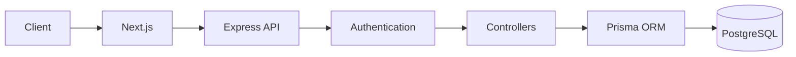
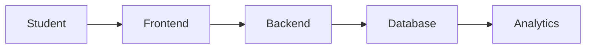
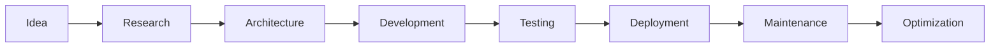

<div align="center">


<br>


<br>

<a href="mailto:santlaj2006@gmail.com">

</a>

<a href="https://linkedin.com/">

</a>

<a href="https://leetcode.com/">

</a>

<a href="https://github.com/Santlaj">

</a>

<a href="https://portfolio.com">

</a>

<br><br>


</div>

---

# 👨‍💻 Engineering Profile

I'm **Santlaj Kumar Mehta**, a Computer Science undergraduate passionate about building scalable backend systems, solving algorithmic problems, and developing AI-powered software.

Rather than simply creating projects, I enjoy understanding **how systems work internally**, focusing on architecture, clean code, authentication, databases, performance optimization, and software engineering best practices.

Currently I'm working toward becoming a strong **Backend Software Engineer** while simultaneously exploring **Agentic AI**, **Large Language Models**, and **System Design**.

---

# 🚀 Current Focus

```text
Backend Development          ███████████░░ 85%

Data Structures & Algorithms ██████████░░░ 80%

AI Engineering               ███████░░░░░░ 55%

System Design                ██████░░░░░░░ 45%

Open Source                  █████░░░░░░░░ 35%
```

---

# 🎯 2026 Goals

- ✅ Reach 500+ LeetCode problems
- ✅ Build production-grade backend projects
- ✅ Master Spring Boot
- ✅ Learn Docker & Kubernetes
- ✅ Learn Redis
- ✅ Learn AWS Cloud
- ✅ Master PostgreSQL
- ✅ Build AI Agents
- ✅ Contribute to Open Source
- ✅ Secure an SDE Internship

---

# 💡 What I Believe

> *"Great software isn't built by writing more code—it's built by designing better systems."*

I enjoy writing maintainable software with proper architecture, modular design, reusable components, and scalable backend services.

---

# 📌 Currently Building

### 🔹 StackAudit

Enterprise-grade backend auditing platform using

- Next.js
- Express
- PostgreSQL
- Prisma
- Better Auth
- TypeScript

---

### 🔹 SmartHelper

AI-powered service booking platform featuring

- Authentication
- Live Location
- Auto Helper Assignment
- PostgreSQL
- REST APIs

---

### 🔹 Digital Study Center

A centralized educational platform helping students organize notes, assignments, and academic resources efficiently.

---

# 🌱 Currently Learning

- Spring Boot
- Redis
- Docker
- Kubernetes
- AWS
- Agentic AI
- LangGraph
- MCP
- RAG Applications

---

# ⚡ Fun Facts

- 💻 Backend is my favorite domain.
- 🧩 I enjoy solving algorithmic challenges.
- 🤖 AI fascinates me because of its real-world impact.
- 📚 I believe learning never stops.
- 🚀 My goal is to build products used by millions.

---

<div align="center">

### ⭐ Thanks for visiting my profile!

*"Code. Learn. Build. Repeat."*

</div>

---
# 🛠️ Tech Stack

<div align="center">

## 💻 Programming Languages

<p>

</p>

---

## 🎨 Frontend Development

<p>

</p>

---

## ⚙️ Backend Development

<p>

</p>

---

## 🗄️ Databases

<p>

</p>

---

## ☁️ Cloud & DevOps

<p>

</p>

---

## 🤖 AI & Machine Learning

<p>


</p>

---

## 🔧 Developer Tools

<p>


</p>

---

# 📊 Skills Overview

| Category | Technologies |
|-----------|--------------|
| **Languages** | C++, Java, Python, JavaScript, TypeScript, SQL |
| **Frontend** | HTML, CSS, Tailwind CSS, React, Next.js |
| **Backend** | Node.js, Express.js, REST APIs, Authentication |
| **Databases** | PostgreSQL, MySQL, MongoDB, Prisma ORM |
| **Authentication** | JWT, Better Auth, OAuth, Session Management |
| **Version Control** | Git, GitHub |
| **DevOps** | Docker, GitHub Actions, Vercel |
| **Cloud** | AWS (Learning), Supabase, Firebase |
| **AI** | Prompt Engineering, Agentic AI, RAG, LangGraph |
| **CS Fundamentals** | DSA, OOP, DBMS, Operating Systems, Computer Networks |

---

# 🧠 Core Engineering Skills

<div align="center">

| Backend | Databases | AI | CS |
|---------|-----------|----|----|
| REST APIs | PostgreSQL | Prompt Engineering | DSA |
| Authentication | MySQL | AI Agents | OOP |
| Authorization | Prisma | LangGraph | DBMS |
| API Design | MongoDB | RAG | OS |
| MVC Architecture | Supabase | MCP | CN |
| Middleware | Redis *(Learning)* | LLM Applications | System Design |

</div>

---

# 📈 Knowledge Progress

```text
C++                         ████████████████████ 100%

Java                        ███████████████░░░░ 80%

JavaScript                  ██████████████░░░░░ 75%

TypeScript                  ███████████░░░░░░░░ 60%

Node.js                     ██████████████░░░░░ 75%

Express.js                  ██████████████░░░░░ 75%

PostgreSQL                  ████████████░░░░░░░ 65%

Prisma ORM                  ███████████░░░░░░░░ 60%

React                       ███████████░░░░░░░░ 60%

Next.js                     █████████░░░░░░░░░░ 45%

Spring Boot                 ██████░░░░░░░░░░░░░ 30%

Docker                      █████░░░░░░░░░░░░░░ 25%

AWS                         ███░░░░░░░░░░░░░░░░ 15%

Agentic AI                  ████████░░░░░░░░░░░ 40%
```

> **Note:** This reflects my current learning journey and will evolve as I continue building real-world projects.

---

# 🎯 Current Tech Focus

<div align="center">

| 🔥 Primary | 🚀 Learning | 📅 Next |
|------------|-------------|---------|
| Backend Development | Spring Boot | Microservices |
| DSA | Docker | Kubernetes |
| PostgreSQL | Redis | AWS |
| Authentication | AI Agents | System Design |
| TypeScript | LangGraph | Production AI Systems |

</div>

---

<div align="center">

## 🚀 I don't just learn technologies.

### I build real-world software with them.

</div>

---
# 🚀 Featured Projects

---

# ⭐ Flagship Project

## 🔷 StackAudit

> **Enterprise-grade auditing and compliance platform for modern applications.**

<p align="center">


</p>

### 📖 Overview

StackAudit is a backend-first platform built to simplify audit logging, authentication, authorization, and compliance tracking. The project emphasizes scalability, clean architecture, security, and maintainability.

---

### 🏗️ Architecture



---

### ✨ Highlights

- JWT Authentication
- Better Auth Integration
- RBAC
- Audit Logging
- Secure REST APIs
- Database Relationships
- Prisma ORM
- Middleware Pipeline
- Error Handling
- Validation
- TypeScript
- Clean Architecture

---

### 📂 Repository

```text
github.com/<YOUR_USERNAME>/StackAudit
```

---

# 🔥 SmartHelper

> AI-powered helper booking platform.

<p align="center">


</p>

### Features

- Live Location
- Auto Assignment
- Role Authentication
- Service Booking
- Availability Tracking
- Rating System
- Admin Dashboard
- Secure APIs

---

### Request Flow

```mermaid
flowchart LR

User

-->

Book

-->

Server

-->

Location Engine

-->

Available Helpers

-->

Nearest Helper

-->

Booking Confirmed
```

---

### Tech Stack

- Node.js
- Express
- PostgreSQL
- JWT
- Supabase
- Leaflet Maps

---

### Repository

```text
github.com/<YOUR_USERNAME>/SmartHelper
```

---

# 📚 Digital Study Center

> One platform for students to manage everything.

### Features

- Notes
- Assignments
- Study Planner
- Attendance
- Timetable
- Dashboard
- Resources
- Progress Tracking

---

### Architecture



---

### Tech Stack

- React
- Node.js
- Express
- PostgreSQL

---

Repository

```text
github.com/<YOUR_USERNAME>/DigitalStudyCenter
```

---

# 🔐 Authentication System

A reusable authentication module for backend applications.

### Includes

- JWT
- Refresh Tokens
- Password Hashing
- Authorization
- Session Handling
- Email Verification
- Forgot Password
- OAuth Ready

---

### Authentication Flow

```mermaid
flowchart LR

Login

-->

JWT

-->

Protected Route

-->

Refresh Token

-->

Logout
```

---

Repository

```text
github.com/<YOUR_USERNAME>/SecureAuth
```

---

# 🤖 AI Agent Projects

Currently building practical AI applications using modern LLM frameworks.

### Learning

- Oracle Agentic AI
- LangGraph
- MCP
- OpenAI SDK
- RAG
- Multi-Agent Systems
- Tool Calling
- Vector Databases

---

Upcoming Projects

- AI Resume Reviewer
- GitHub AI Assistant
- Documentation Generator
- AI Code Reviewer
- Research Assistant
- Personal Knowledge Base

---

# 💻 DSA Repository

My collection of algorithm implementations and interview solutions.

### Contents

- Arrays
- Strings
- Linked List
- Trees
- Graphs
- Dynamic Programming
- Greedy
- Sliding Window
- Binary Search
- Heap
- Trie
- Segment Tree

Repository

```text
github.com/<YOUR_USERNAME>/DSA
```

---

# 🏆 Engineering Principles

<div align="center">

| Principle | Description |
|-----------|-------------|
| Clean Code | Readable and maintainable |
| Scalability | Designed for growth |
| Security | Authentication-first approach |
| Performance | Optimized algorithms |
| Modularity | Reusable components |
| Testing | Reliable software |
| Documentation | Developer-friendly |
| Continuous Learning | Improve every day |

</div>

---

## 📈 Project Roadmap

```text
✔ StackAudit

████████████████████░░

80%

✔ SmartHelper

███████████████░░░░░░░

65%

✔ Digital Study Center

██████████░░░░░░░░░░░░

45%

✔ AI Agent Suite

██████░░░░░░░░░░░░░░░░

30%

✔ Secure Authentication

██████████████████░░░░

90%
```

---

<div align="center">

### 🚀 Every project is built with scalability, clean architecture, and production-ready engineering practices in mind.

</div>

---
# 📊 GitHub Analytics

<div align="center">

## 💻 GitHub Overview

&show_icons=true&theme=tokyonight&hide_border=true&count_private=true&include_all_commits=true"/>

&theme=tokyonight&hide_border=true"/>

<br><br>

&layout=compact&theme=tokyonight&hide_border=true"/>

&theme=tokyonight"/>

</div>

---

# 📈 Contribution Activity

<div align="center">

&theme=tokyo-night&hide_border=true"/>

</div>

---

# 🐍 Contribution Snake

<div align="center">

/<YOUR_USERNAME>/output/github-contribution-grid-snake-dark.svg"/>

</div>

> ⚠️ Requires GitHub Actions.

---

# 🏆 GitHub Achievements

<div align="center">

&theme=tokyonight&no-frame=true&no-bg=true&row=2&column=4"/>

</div>

---

# 📅 Contribution Calendar

<div align="center">

&theme=github-compact&hide_border=true"/>

</div>

---

# 📊 GitHub Summary Cards

<div align="center">

&theme=tokyonight"/>

&theme=tokyonight"/>

<br><br>

&theme=tokyonight"/>

&theme=tokyonight&utcOffset=5.5"/>

</div>

---

# 📚 Competitive Programming

<div align="center">

## LeetCode


</div>

---

## 🎯 Coding Platforms

<div align="center">

| Platform | Profile |
|-----------|----------|
| 🟠 LeetCode | https://leetcode.com/u/YOUR_LEETCODE_USERNAME |
| 🔵 Codeforces | https://codeforces.com/profile/YOUR_CODEFORCES_USERNAME |
| 🟤 CodeChef | https://www.codechef.com/users/YOUR_CODECHEF_USERNAME |
| 🟢 GitHub | https://github.com/<YOUR_USERNAME> |

</div>

---

# 📈 Problem Solving Journey

```text
Arrays                     ████████████████████

Strings                    ███████████████████

Linked List                ██████████████████░

Stack                      █████████████████░░

Queue                      ████████████████░░░

Trees                      ██████████████░░░░░

BST                        ██████████████░░░░░

Heap                       ████████████░░░░░░░

HashMap                    █████████████████░░

Binary Search              █████████████████░░

Sliding Window             ███████████████░░░░

Recursion                  ███████████████░░░░

Backtracking               ███████████░░░░░░░░

Graphs                     ██████████░░░░░░░░░

Trie                       ████████░░░░░░░░░░░

Dynamic Programming        ███████░░░░░░░░░░░░

Segment Tree               █████░░░░░░░░░░░░░░

System Design              ██████░░░░░░░░░░░░░
```

---

# 🎖️ Developer Metrics

<div align="center">

| Metric | Status |
|---------|--------|
| Backend Development | ⭐⭐⭐⭐⭐ |
| REST APIs | ⭐⭐⭐⭐⭐ |
| Database Design | ⭐⭐⭐⭐☆ |
| Authentication | ⭐⭐⭐⭐⭐ |
| C++ | ⭐⭐⭐⭐⭐ |
| Java | ⭐⭐⭐⭐☆ |
| SQL | ⭐⭐⭐⭐☆ |
| JavaScript | ⭐⭐⭐⭐☆ |
| TypeScript | ⭐⭐⭐☆☆ |
| AI Engineering | ⭐⭐⭐☆☆ |
| Docker | ⭐⭐☆☆☆ |
| AWS | ⭐☆☆☆☆ |

</div>

---

# 📈 Development Activity

```text
Backend Development      ████████████████████████

Algorithms               ████████████████████

Database Design          █████████████████

Open Source              ███████████

AI Engineering           ███████████

Cloud Computing          ███████

DevOps                   ██████

System Design            █████
```

---

# 📌 Current Engineering Goals

- 🚀 Reach **500+ LeetCode** problems
- 🏗️ Build **5 production-grade backend projects**
- 🐳 Master Docker
- ☁️ Learn AWS
- 📚 Master Spring Boot
- 🤖 Build AI Agents
- 🌍 Contribute to Open Source
- 💼 Secure an SDE Internship

---

<div align="center">

## ⚡ Consistency beats intensity.

**Every commit is one step toward becoming a better engineer.**

</div>

---
# 🏗️ Software Engineering Journey

<div align="center">

> *"I don't just build applications — I engineer scalable, maintainable systems."*

</div>

---

# 🎯 Engineering Roadmap

```mermaid
flowchart LR

A[C++] --> B[Data Structures]
B --> C[Algorithms]
C --> D[Backend Development]
D --> E[Databases]
E --> F[Authentication]
F --> G[REST APIs]
G --> H[System Design]
H --> I[Cloud Computing]
I --> J[DevOps]
J --> K[AI Engineering]
K --> L[Open Source]
L --> M[Software Engineer]
```



---

# ⚙️ Backend Development Roadmap

<div align="center">

| Stage | Technologies |
|--------|--------------|
| ✅ Fundamentals | C++, Java, OOP, DBMS |
| ✅ Backend Basics | Node.js, Express |
| ✅ Database | PostgreSQL, MySQL |
| ✅ ORM | Prisma |
| ✅ Authentication | JWT, Better Auth |
| 🔄 API Design | REST APIs |
| 🔄 Deployment | Vercel, Render |
| 🟡 Caching | Redis |
| 🟡 Containers | Docker |
| 🟡 Cloud | AWS |
| 🟡 Microservices | Spring Boot |
| 🟡 DevOps | Kubernetes |

</div>

---

# 🧠 Computer Science Fundamentals

<div align="center">

| Subject | Status |
|---------|--------|
| Data Structures | ⭐⭐⭐⭐⭐ |
| Algorithms | ⭐⭐⭐⭐☆ |
| Object-Oriented Programming | ⭐⭐⭐⭐⭐ |
| Operating Systems | ⭐⭐⭐⭐⭐ |
| Database Management Systems | ⭐⭐⭐⭐☆ |
| Computer Networks | ⭐⭐⭐⭐☆ |
| SQL | ⭐⭐⭐⭐☆ |
| Software Engineering | ⭐⭐⭐⭐☆ |
| System Design | ⭐⭐☆☆☆ |

</div>

---

# 🚀 Current Learning

### Backend

- Spring Boot
- Advanced REST APIs
- API Versioning
- Rate Limiting
- Redis
- Docker
- Kubernetes

---

### AI Engineering

- Agentic AI
- LangGraph
- MCP
- OpenAI SDK
- Prompt Engineering
- RAG
- Multi-Agent Systems
- Vector Databases

---

### Cloud

- AWS EC2
- AWS S3
- IAM
- Lambda
- Docker Deployment
- CI/CD

---

# 📜 Certifications

| Certification | Status |
|---------------|--------|
| C Programming | ✅ |
| Introduction to AI & ML | ✅ |
| Oracle Agentic AI Foundations | 🔄 In Progress |
| Spring Boot | 🟡 Planned |
| AWS Cloud Practitioner | 🟡 Planned |

---

# 💼 Experience

## 👨‍💻 Personal Projects

I focus on developing real-world software that emphasizes:

- Clean Architecture
- Secure Authentication
- Scalable APIs
- Database Design
- Performance
- Software Engineering Principles

---

## 🌍 Open Source

Current Goals

- Make regular GitHub contributions
- Contribute to backend projects
- Improve documentation
- Participate in Hacktoberfest
- Publish reusable developer tools

---

# 🏆 2026 Milestones

```text
✅ 500+ LeetCode Problems

████████████████████░░

✅ Build 5 Major Projects

███████████████░░░░░░░

✅ Master Backend

████████████████░░░░░░

✅ Learn AI Agents

███████████░░░░░░░░░░░

✅ Open Source

████████░░░░░░░░░░░░░░

✅ Internship

██████░░░░░░░░░░░░░░░░
```

---

# 📚 Engineering Philosophy

> **Code should be easy to understand, easy to maintain, and difficult to break.**

I believe software engineering is not about writing the most code—it's about designing reliable systems that solve real problems.

Every project I build follows these principles:

- Clean Code
- Scalability
- Security First
- Maintainability
- Documentation
- Simplicity
- Performance
- Continuous Improvement

---

# 📖 Development Workflow



---

# ❤️ Outside of Coding

- 📚 Reading technical blogs
- 🧩 Solving DSA problems
- 🤖 Exploring AI
- 🌍 Learning new technologies
- 🚀 Building side projects
- 🎯 Improving every day

---

# 📬 Let's Connect

<div align="center">

<a href="mailto:YOUR_EMAIL">

</a>

<a href="https://linkedin.com/in/YOUR_LINKEDIN">

</a>

<a href="https://github.com/YOUR_USERNAME">

</a>

<a href="https://leetcode.com/YOUR_LEETCODE">

</a>

</div>

---

<div align="center">

# ⭐ Thanks for visiting!


### *"Build. Learn. Share. Repeat."*

</div>
